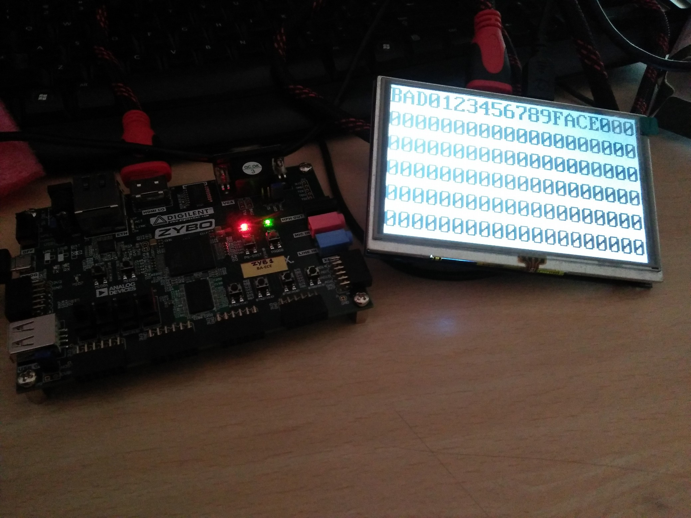

# Kepad-HDMI Interface
Keypad input to generate text on HDMI Display using Zybo

# Description

This project aims at building a HDMI and keypad interface using Digilent Zybo Board. Keypad input
is given using Pmod Keypad through Pmod port on Zybo. HDMI Output on the board is connected
to a 5 inch 800x480 screen.

Keypad has 4 rows and 4 columns having 16 keys representing hex characters from 0 to F. HDMI
Display Screen is divided into 20 x 6 display keeping Font Size of 40 x 80 for each character. Initially,
screen is blank with white background. On each key press, a character is added to the right of last
charcater, Text font color is black.

Reset button resets the screen. Clear button clears the sreen.

# Timing Requirements

For 800 x 480 screen,
For H_{sync},
T_{fp} = 40 clock cycles ;
T_{pw} = 48 clock cycles ;
T_{disp} = 800 clock cycles;
T_{bp} = 40 clock cycles;
=> T_s = T_{fp} + T_{pw} + T_{disp} + T_{bp} = 928 clock cycles;

For V_{sync},
T_{fp} = (13 x T_{s,H_{sync}}) clock cycles = (13 x 928) clock cycles;
T_{pw} = (3 x T_{s,H_{sync}}) clock cycles = (3 x 928) clock cycles;
T_{disp} = (400 x T_{s,H_{sync}}) clock cycles = (400 x 928) clock cycles;
T_{bp} = (29 x T_{s,H_{sync}}) clock cycles = (29 x 928) clock cycles;
= > T_s = T_{fp} + T_{pw} + T_{disp} + T_{bp} = (525 * T_{s,H_{sync}}) clock cycles = (525 x 928) clock cycles;

At refresh rate of 60 Hz, number of clock cycles required is 928 x 525 x 60 = 29232000;
So, pixel clock is set to 30 Mhz.
Each pixel has 24 bits of data which is encoded into 30 bits of data. This is serialised to 3 different
channels. So, serial clock should be able to support 10 times data rate and pixel clock. So, 5 times the
pixel clock is chosen as serial clock frequency along with DDR (double data rate).

Font ROM: The appearance of the characters on the screen is determined by a "font ROM". The font
ROM contains the pattern of pixels that should be displayed on the screen when a particular character
needs to be displayed. The bits within the font ROM indicate which pixels of a 8 x 16 bit tile should be
displayed in the 'foreground' and which pixels on the display should be displayed in the background. A
'1' in the font ROM indicates the corresponding pixel should be displayed in the foreground (i.e., white


in our case) while a '0' in the font ROM indicates that the corresponding pixel should be blanked or put
in the background (black in our case). The text below demonstrates the contents of the font ROM for
the upper-case character 'A':

```
"00000000", -- 0
"00000000", -- 1
"00010000", -- 2    *
"00111000", -- 3   ***
"01101100", -- 4  ** **
"11000110", -- 5 **   **
"11000110", -- 6 **   **
"11111110", -- 7 *******
"11000110", -- 8 **   **
"11000110", -- 9 **   **
"11000110", -- a **   **
"11000110", -- b **   **
"00000000", -- c
"00000000", -- d
"00000000", -- e
"00000000", -- f
```
Character Memory: In addition to the font ROM, we use a "character memory" that stores the
character value at each of the 20x6 character locations on the display. The minimum size of this
memory is 20x6x4 bits to provide enough room to store characters (one nibble each) for each of the 20
columns and 6 rows.

This memory has two memory ports: a character read port and a character write port. The read port is
needed by the character generator to read the character value of the current character location. The
write port is used to update the contest of the character display.

The char_read_addr port is a 7 bit signal used to determine which location in the character memory to
read. The result of the read is available on the char_read_value. Like the font ROM, this character
ROM will provide the character result one clock cycle after the address is provided.

The second memory port is the character write port. This write port is used to update the contents of
the character memory so the display can be changed. This port operates simultaneously with the read
port so the character display can access characters while the character memory is being updated. Three
signals are used for this port. The char_write_addr signal is used to indicate the address within the
character memory that will be updated. The char_write_value is the value that will be written at this
address. The char_we signal is the control signal to enable a write into the character memory. When
the char_we signal is asserted, the value on the char_write_value signal will be written at address
char_write_addr at the next clock edge.

Character Memory is used to give video_data to TMDS signal generator.


# State Diagram for Keyboard Input


After each 4 ms, a column is made low. Then, each row is checked for low signal. Corresponding after
each 16 ms, it is recorded whether a key was pressed. Then, cur state is recorded. If last state was not
key pressed and cur state is key pressed, then keypad writes to character memory.

# Timing Analysis

System Clock
System Clock (Time Period) = 8 ns;

Worst Negative Slack (Pulse width) = 2 ns

Pixel Clock
Pixel Clock (Time Period= 33.33 ns

Worst Negative Slack (Setup) = 5.44 ns

Worst Negative Slack (Hold) = 0.177 ns

Worst Negative Slack (Pulse width) = 16.167 ns

Serial Clock
Serial Clock (Time Period) = 6.66 ns;

Worst Negative Slack (Pulse width) = 4.511 ns

Resource Utilisation

LUTs = 1189
FFs = 690

# Results on Board (HDMI Display)



# Conclusion

20 x 6 Text Displaying hex characters was implemented using Zybo board HDMI Output printing
characters on screen taking input from Pmod Keypad.

Complete Documentaion can be found [here](Project_Documentation.pdf).

# References

[Digital Visual Interface Specification](dvi_spec-V1_0.pdf)

VGA Text Generator-
https://ece320web.groups.et.byu.net/labs/VGATextGeneration/VGA_Terminal.html
